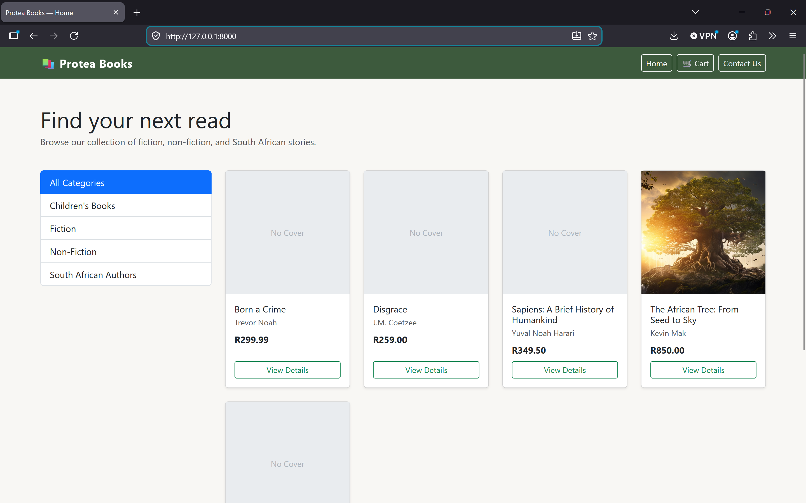
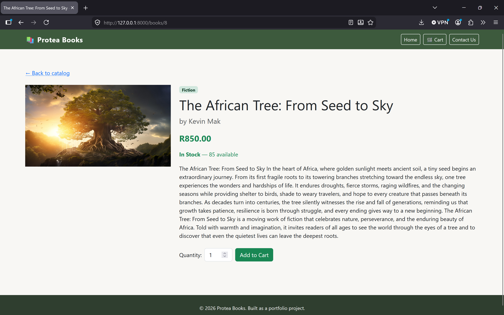
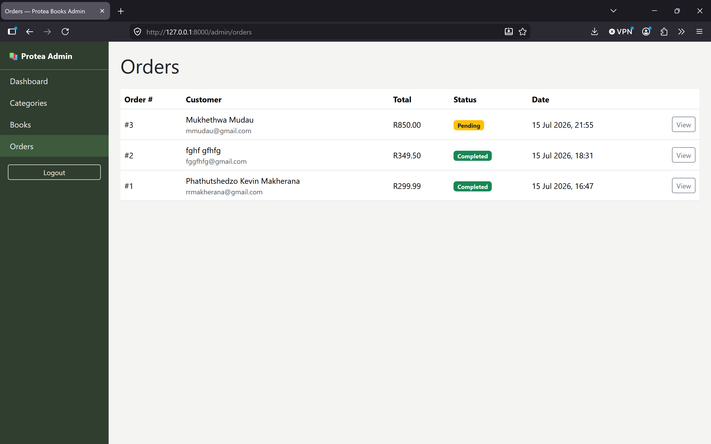

# Protea Books — Online Bookstore

A full-stack e-commerce web application for an online bookstore, built as a portfolio project demonstrating Laravel MVC architecture, relational database design, and a complete customer-to-admin business workflow.

## The Problem

Protea Books needed an online storefront where customers could browse and buy books, and staff could manage inventory and fulfil orders — without relying on spreadsheets or manual processes. This application provides a public storefront with cart and checkout, and a separate login-protected admin panel for managing categories, books, and order status.

## Features

**Storefront (public)**
- Browse books by category, with pagination
- Book detail pages with cover images, stock status, and descriptions
- Session-based shopping cart (add, remove, quantity)
- Checkout with server-side stock validation (prevents overselling)
- Order confirmation page
- Contact Us page

**Admin Panel (login-protected)**
- Dashboard with live stats: total books, total orders, pending orders, revenue
- Categories: full CRUD, with delete protection if books are assigned
- Books: full CRUD, including cover image upload, with delete protection if a book has order history
- Orders: view order details and update status (Pending / Completed / Cancelled)

## Tech Stack

- **PHP 8.2** / **Laravel 12**
- **MySQL** (via XAMPP's MariaDB locally)
- **Blade** templating
- **Bootstrap 5** (via CDN) for styling
- **Laravel's built-in authentication** (`Auth` facade) for the admin panel

## Screenshots

## Getting Started

### Prerequisites

- PHP 8.2 or newer
- Composer
- MySQL (or MariaDB, e.g. via XAMPP)

### Installation

1. Clone the repository:

git clone https://github.com/KevinMakherana/protea-books.git
cd protea-books

2. Install dependencies:

composer install

3. Copy the environment file and generate an app key:

copy .env.example .env
php artisan key:generate

4. Open `.env` and set your database credentials:

DB_CONNECTION=mysql
DB_HOST=127.0.0.1
DB_PORT=3306
DB_DATABASE=protea_books
DB_USERNAME=root
DB_PASSWORD=

5. Create the database (via phpMyAdmin, or the MySQL CLI):

CREATE DATABASE protea_books;

6. Run migrations and seed sample data (categories, books, and an admin user):

php artisan migrate --seed

7. Link storage so uploaded book cover images are publicly viewable:

php artisan storage:link

8. Start the development server:

php artisan serve

9. Visit **http://127.0.0.1:8000** for the storefront.

### Admin Access

- URL: **http://127.0.0.1:8000/admin**
- Email: `admin@proteabooks.test`
- Password: `password`

## Database

Four core tables: `categories`, `books`, `orders`, and `order_items`, with foreign key constraints (books belong to a category; order items reference both an order and a book). Deleting a category or book with existing order/stock history is blocked at the application level with a clear error message, rather than allowed to silently break data integrity.

## Project Structure

app/Http/Controllers/       # Public controllers (Book, Cart, Checkout)
app/Http/Controllers/Admin/ # Admin controllers (Auth, Dashboard, Category, Book, Order)
app/Models/                 # Eloquent models and relationships
database/migrations/        # Table schemas
database/seeders/           # Sample categories, books, and admin user
resources/views/            # Blade templates (public + admin, separate layouts)
routes/web.php              # All application routes

## Future Improvements

- Customer accounts and order history (currently checkout is guest-only)
- Search functionality across the catalog
- Email notifications on order status change
- Payment gateway integration

## License

This project is licensed under the MIT License — see the [LICENSE](LICENSE) file for details.